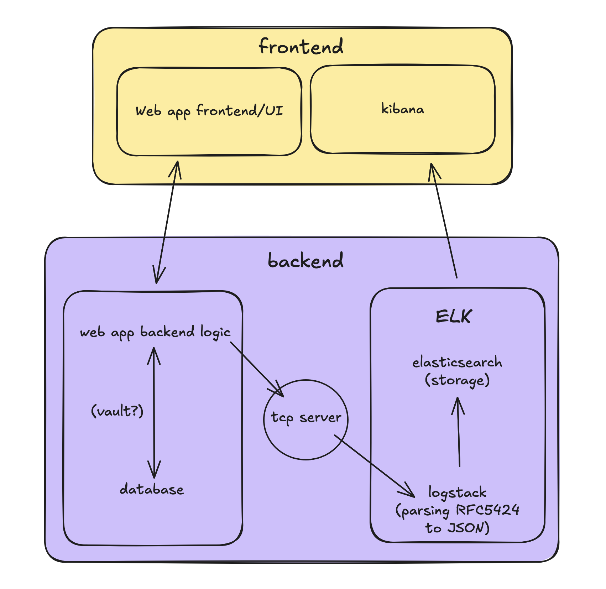

# ELK Stack Setup

## quick setup

1. **Open Kibana**: http://localhost:5601
2. **Create Index Pattern**: In Kibana, go to "Management" > "Index Patterns" > "Create Index Pattern". Enter `ft_transcendence-*` and follow the prompts.
3. **Explore Logs**: Navigate to "Discover" to explore logs.
4. **Import Dashboards**: Import our pre configured dashboards from a `.ndjson` file.
5. **Create Alerts**: Set up alerts for critical log events. (optional)

## explanation of components
- **Logstash**: Processes and transforms log data before sending it to Elasticsearch.
- **Elasticsearch**: Stores and indexes log data.
- **Kibana**: Visualization and exploration tool for log data.

## ports used
- **Kibana**: `5601`
- **Elasticsearch**: `9200`
- **Logstash**: `5000` (TCP for Fastify logs), `9600`

## how to add logging to our app (fastify)
The logger is already configured in the Fastify app to send logs to Logstash in JSON format with Pino. To add custom logs, use the following pattern:

```javascript
request.log.level({				   // e.g., info, error, warn instead of level
	event_type: 'your_event_type', // e.g., 'user_registration'
	user_id: userId,               // e.g., 123 or omit for anonymous
	username: username,            // e.g., 'johndoe'
	request_id: request.id,        // Unique request ID / idk if this one works
	ip: request.ip,         // Client IP address
	response_time_ms: reply.elapsedTime, // Request duration in ms
});
```

More are probably available but these are the main ones.
all log levels are supported: `trace`, `debug`, `info`, `warn`, `error`, `fatal`.

## tcp server setup
In our ELK docker-compose file, we have a Logstash service that listens on TCP port `5000` for incoming log data from the Fastify application, and in the main docker-compose file, we have a syslog service that forwards sends syslog messages to port '5000' as well. Then in ``logstash.conf``, we have an input section that defines a TCP input plugin listening on port `5000` to receive the log data. Both composers run on a shared network so they can communicate.

